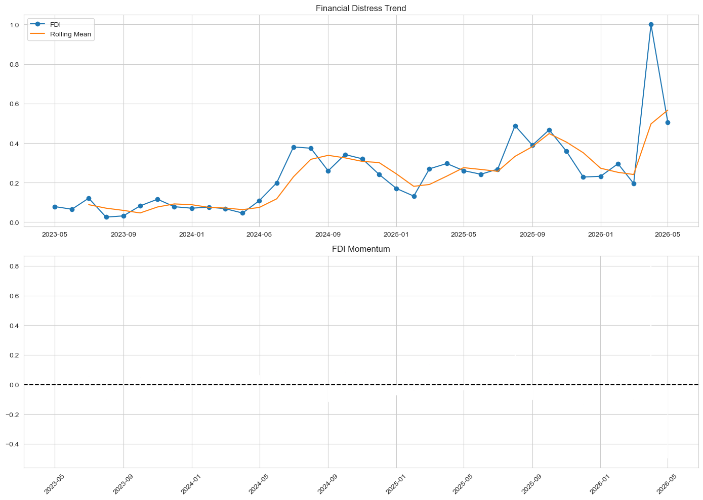

# Pesa-Salama-Classifier
## Real-time Financial Complaint Monitor and Distress Index for Kenya’s Mobile Money Ecosystem

An end-to-end NLP pipeline that collects, cleans, and classifies customer reviews from Kenya's top fintech apps, combining classical machine learning with a multilingual transformer (AfriBERTa) to power a real-time financial complaint monitoring system.

---

## Project Overview

Kenya's mobile money and digital banking ecosystem processes millions of user transactions daily. Buried in Google Play Store reviews lies a rich, real-time signal of customer frustration edident through failed transactions, fraud complaints, hidden charges, and broken UX. These are expressed in written English, Swahili, and Sheng languages.

This project builds an automated pipeline to:

- Scrape raw, multilingual reviews from six major Kenyan fintech apps
- Preprocess and clean code-switched (English/Swahili/Sheng) text
- Classify reviews by sentiment (positive / neutral / negative)
- Detect complaint categories (fraud, failed transaction, hidden charges, customer support)
- Explain model predictions using SHAP
- Fine-tune AfriBERTa, a pretrained African-language transformer, for advanced classification

The end goal is a deployable monitoring system that flags emerging complaint trends in real time.

---

## Dataset

| Property | Detail |
|---|---|
| **Source** | Google Play Store — Kenya country store (`country='ke'`) |
| **Collection method** | `google-play-scraper` Python library (no API key required) |
| **Raw records** | 53,500 reviews |
| **Date range** | 2023 – April 2026 |
| **Languages** | English, Swahili, Sheng (code-switched) |

### Apps Scraped

| App | Play Store ID | Category |
|---|---|---|
| M-PESA | `com.safaricom.mpesa.lifestyle` | Core mobile money |
| MySafaricom | `com.safaricom.mysafaricom` | Account management |
| KCB Mobile | `com.kcb.mobilebanking.android.mbp` | Traditional bank |
| Equity Mobile | `ke.co.equitygroup.equitymobile` | Traditional bank |
| Tala | `com.inventureaccess.safarirahisi` | Digital micro-lending |
| Branch | `com.branch_international.branch.branch_demo_android` | Digital micro-lending |

### Key Columns (cleaned dataset)

| Column | Description |
|---|---|
| `content` | Original review text |
| `score` | Star rating (1–5) |
| `sentiment` / `sentiment_label` | Positive / Neutral / Negative |
| `complaint_label` | Complaint category (keyword-classified) |
| `fraud_indicator` | Boolean flag for fraud-related language |
| `cleaned_text` | Normalised, emoji-decoded text |
| `processed_text` | Fully preprocessed text ready for TF-IDF |
| `final_language` | Detected language (en / sw / mixed) |
| `app_name` | Source application |

---

 **Convention:** `MASTER_RAW_kenya_fintech.csv` is the permanent, untouched source of truth. All transformations are applied to copies in the preprocessing notebook.

 ##  Pipeline Walkthrough

### 1. Data Extraction 
Reviews are scraped from the Kenya Google Play Store using `google-play-scraper`. Up to 10,000 reviews are collected per app (sorted by newest), then concatenated into a single master CSV.

- **Total reviews collected:** ~53,500 across 6 apps
- **Date range:** 2023 – April 2026
- **Languages:** English, Swahili, Sheng (code-switched)
- **Raw file is never modified after saving**

### 2. Exploratory Data Analysis
Distribution of ratings, review volumes per app, temporal trends, language detection, and emoji usage are examined to guide preprocessing and modelling decisions.

- Review count per app

- star-rating distributions

-  Time trend for number of riviews

### 3. Data Preprocessing
A multi-step NLP pipeline cleans and prepares the text:

- Removal of empty reviews, unnecessary columns, and duplicate IDs
- Emoji conversion to text descriptions
- Language detection (`lingua`) and Sheng identification
- Text normalisation — lowercasing, punctuation removal, URL stripping
- Tokenisation, stopword removal, stemming, and lemmatisation
- Feature engineering: `sentiment_label`, `complaint_label`, `fraud_indicator`, `review_length`, `word_count`
## Modelling
### 4. LDA Topic Modelling
Latent Dirichlet Allocation is applied to negative reviews only to surface hidden complaint themes:

| Topic | Label |
|-------|-------|
| 0 | Fraud Complaint |
| 1 | Failed Transaction |
| 2 | Hidden Charges |
| 3 | Customer Support |

- Because Kenyan users pack multiple complaints into short, emotionally charged reviews, LDA topics overlap significantly. A keyword classifier (`complaint_label`) becomes more reliable for downstream modelling.

### 5 · Classical ML Modelling

Three models trained on TF-IDF features, evaluated with weighted F1-score:

- **Logistic Regression** (baseline)
- **XGBoost** (default settings)
- **XGBoost** (hyperparameter-tuned via `RandomizedSearchCV`, 30 iterations, 5-fold stratified CV)

SHAP `TreeExplainer` is used to explain individual predictions and creates the most influential tokens per sentiment class.

#### Key SHAP Insights

| Negative drivers | Positive drivers |
|---|---|
| `worst`, `useless`, `terrible`, `slow`, `crashing`, `login` | `excellent`, `best`, `great`, `awesome`, `efficient`, `reliable` |

### 6. AfriBERTa Transformer Model (`06`)
A multilingual transformer model fine-tuned on African languages is adapted for the Kenya fintech context. AfriBERTa handles code-switched Swahili/Sheng/English text that traditional models underperform on.

- **Base model:** `castorini/afriberta_large`
- **Framework:** HuggingFace Transformers + PyTorch
- **Evaluation:** Weighted F1, classification report, confusion matrix
- **Training environment:** Google Colab (GPU-accelerated)

#### Modelling Results
TF-IDF vectorisation feeds three classifiers for **sentiment classification** (negative / neutral / positive):

| Model | Weighted F1 | Precision | Recall | CV F1 (5-fold) |
|-------|------------|-----------|--------|----------------|
| Logistic Regression (Baseline) | 0.828 | 0.855 | 0.805 | 0.826 |
| XGBoost Intermediate | 0.818 | 0.810 | 0.847 | 0.816 |
| **XGBoost Advanced (Tuned)** | **0.848** | **0.837** | **0.869** | **0.849** |

- Recommended production model: XGBoost Advanced (Tuned)

### 7. Financial Distress Index
A composite **FDI** is constructed from four normalised indicators:

| Indicator | Description |
|-----------|-------------|
| **Complaint Pressure** | Monthly complaint rate |
| **Rating Stress** | Deviation from maximum rating |
| **Trend Acceleration** | Complaint growth vs rolling average |
| **Shock Intensity** | Z-score standardised anomaly signal |

The FDI is scaled 0–1 and classified into four distress levels:

- 🟢 **Green** — Normal operations
- 🟡 **Yellow** — Elevated stress, monitor closely
- 🟠 **Orange** — High distress, action recommended
- 🔴 **Red** — Critical — systemic risk detected

Aanalysis of the velocity and direction of financial distress trends over time.

The Financial Distress Index provides a practical approach for detecting risk patterns early and supporting data-driven decision-making.